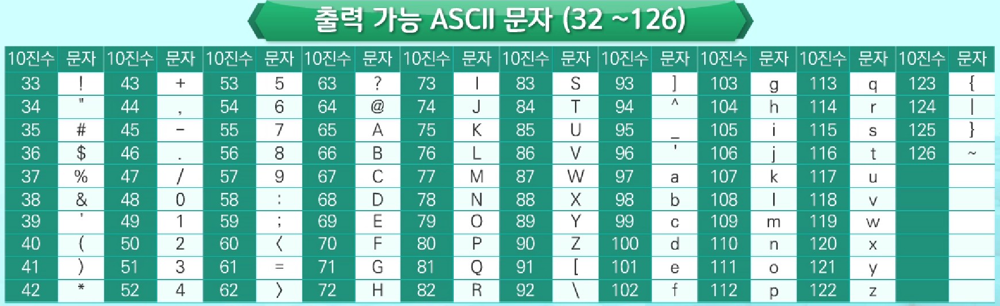
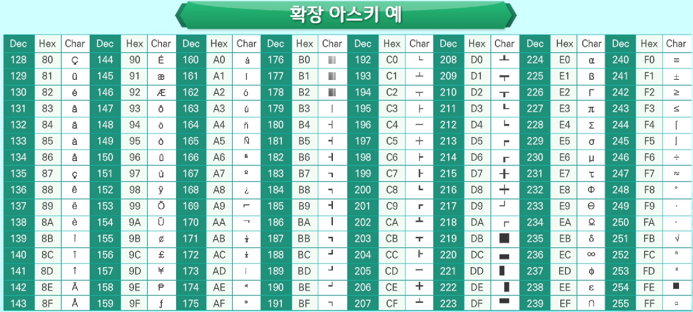

[TOC]

# Python

> 1980년대 말 고안
>
> 1991.2.20 귀도 반 로섬이 발표

독립적이며, 인터프리터 방식의 객체지향이고, 동적인 그리고 대화형 성격을 가진 프로그래밍 언어

- 장점

  - 폭넓은 사용자층
  - 빠른 학습속도
  - 명령의 수행 결과를 빠르게 확인 가능
  - 확장 기능 지원
  - 다양한 플랫폼에서 사용 가능

- 단점

  - 수행 속도 느림 → 컴퓨터 파워 높아지면서 격차 줄어듬

- 종류

  - **Cpython** (표준)

    C로 작성된 파이썬

  - **IronPython**

    .Net과 Mono용

    C#으로 구현

  - **Jython**

    자바로 구현된 파이썬

    자바가상머신에서 동작 (자바 클래스, 자바 표준 라이브러리 사용 가능)

  - **PyPy**

    파이썬으로 구현

- 특징

  - 인터프리팅 방식

    명령의 실행결과를 대화형으로 바로 확인

  - 동적 타이핑(dynamic typing)

    실행 시간 값에 의해 자료형 결정

  - Garbage Collector

    생성된 객체에 대한 메모리 관리

  - 가독성

    ex) 코드블록의 들여쓰기

  - 풍부한 라이브러리

    표준 라이브러리와 통합환경이 배포판과 함께 제공

    - 정규 표현식
    - 운영 체제의 시스템 호출
    - XML 처리
    - 직렬화
    - 각종 통신 프로토콜
    - 전자 메일이나 CSV 파일의 처리
    - 데이터베이스 접속
    - 그래픽 사용자 인터페이스
    - HTML, 파이썬 코드 구문 분석 도구

  - 유니코드

  - 오픈소스

    파이썬 소프트웨어 재단에서 관리

  - 다양한 프로그래밍 패러다임 지원

    객체 지향, 함수형 프로그래밍 지원

  - 학습 용이성

    [프로그램의 문서화]도 언어의 기본 기능에 포함

    도움말 문서와 API도 체계적으로 정리

    읽기 쉽고, 효율적인 코드를 간단하게 쓰려는 철학 반영

    > **API(Application Programming Interface)**
    >
    > 운영체제가 제공하는 함수의 집합체

  - 내장 스크립트 언어

    다른 언어로 쓰인 모듈을 연결하려는 목적으로 이용되며 많은 상용 프로그램에 내장되어 스크립트 언어로 활용

- 버전

  - 2.0 (2000.10.16)
    - Garbage Collector(쓰레기 수집기)와 유니코드(Unicode) 지원
    - 개발 과정에서의 투명한 공동체 지원
  - 3.0 (2008.12.03)
    - 2.x대 버전의 파이썬과 하위호환성이 없음
    - 주요 기능 다수가 이전 버전과 호환되도록 파이썬 2.6과 2.7버전에 반영됨

  > - 차이점
  >   - 내장자료형의 내부적인 변화 및 일부 자료형의 구성 요소 제거
  >   - 표준 라이브러리의 패키지 재배치
  >   - 향상된 유니코드 지원
  >     - 3.0부터는 문자열처럼 표현
  >     - 한글 변수명 사용 가능
  >   - print문의 print()함수로의 변화
  >   - 인코딩
  >     - 2.x 버전 : ASCII `#-*- coding: utf-8 -*-`
  >     - 3.x 버전 : 유니코드 UTF-8

- 활용 분야

  - 웹 애플리케이션 개발 분야

    - Django

      - 특징
        - 회원가입, 사용자 인증 등 공통기능을 제공해 높은 개발 생산성 지원

    - Flask

      파이썬 용 마이크로 프레임워크

      - 특징
        - 간단한 웹 서비스 / 모바일 서버 구축에 적합

  - 데이터 수집 분야

    - Beautiful soup

      웹 크롤링 라이브러리

      - 특징
        - 문서 수집
        - HTML 문서에 대한 구문 분석
        - DOM 트리 탐색 등의 기능
        - 문서 분석 및 정보 추출 기능

    - Scrapy

      웹 크롤링 프레임워크

      - 특징
        - 웹 문서에서 데이터 추출 규칙 작성 → 문서 수집 및 필요 데이터 자동 추출

  - 데이터 과학 및 인공지능 분야

    - NumPy

      과학 분야의 컴퓨팅을 위한 필수 패키지

      - 특징
        - 강력한 다차원 배열 객체 지원
        - 선형대수 가능
        - 푸리에 변환 가능
        - 난수 생성 기능

    - Pandas

      데이터 분석 시 사용하는 표준 라이브러리

      - 특징
        - 강력한 데이터 구조와 다양한 분석 도구 제공

    - SciPy

      수학, 과학, 엔지니어링 분야에서 활용

    - Scikit-learn

      데이터 마이닝과 데이터 분석을 위한 도구

      - 특징
        - 분류, 회귀, 군집, 차원축소와 같은 머신러닝 지원

    - TensorFlow

      구글이 공개한 머신러닝 및 딥러닝 프레임워크

      - 특징
        - GPU를 이용한 연산 지원
        - 각종 신경망 모델을 쉽게 구현하도록 지원

    - Pytorch

      머신러닝 및 딥러닝 프레임워크

      - 특징
        - GPU를 이용한 연산 지원
        - 간결한 코드
        - 신경망 모델을 쉽게 구현하도록 지원
        - 빠른 모델 훈련 시간
        - 실시간으로 결과값 시각화

## 자료형

> **리터럴(Literal)**
>
> 소스코드 상에서 내장 자료형의 상수 값을 나타내는 용어
>
> - `type()` : 리터럴의 자료형 확인

### 숫자형

#### 정수형 `int`

- 종류
  - 양의 정수
  - 0
  - 음의 정수
- 특징
  - 정수형의 길이 무제한, 메모리가 허용하는 범위까지 사용 가능
  - 접두어
    - 0o : 8진수
    - ox : 16진수
    - ob : 2진수
  - `_` 무시

#### 부동소수점형 `float`

- 종류
  - 양의 부동소수점
  - 음의 부동소수점
- 특징
  - 소수부 생략 가능   ex) `10. ⇒ 10.0`
  - 정수부 생략 가능   ex) `.001 ⇒ 0.001`
  - 지수 표기법 사용 가능 (매우 큰 수, 매우 정밀한 수 표현) `e`
  - `_` 무시

#### 허수형

- 특징
  - j 접미사 사용
  - `_` 무시

### 문자열 `str`

문자들의 집합 

- 특징

  - 단일행 `""`/`''`, 다중행 `""""""`/`''''''`

  - 이스케이프 문자

    | 표현 |  의미  |
    | :--: | :----: |
    | `\\` |   \    |
    | `\'` |   '    |
    | `\"` |   "    |
    | `\n` | 줄바꿈 |
    | `\t` |   탭   |

- 문자열 포맷팅

  문자열 내에 사용된 문자열 표시 유형(문자열 포맷 코드)을 특정 값으로 변경하는 기법

  - **%-포맷팅**

    - 사용 방법
      - 하나의 값 : `"%유형" % 값`
      - 여러 개의 값 : `"%유형 %유형" % (값1, 값2)`
      - 문자열 출력 폭과 정렬 방향
        - 우측정렬 : `%10s` ⇒ `_____우측정렬`
        - 좌측정렬 : `%-10s` ⇒ `좌측정렬______`
      - 부동소수점 출력 폭 지정 및 소수점 이하의 정밀도 표현
        - `%0.2f` ⇒ `3.14`
        - `%10.2f` ⇒ `______3.14`
        - `%010.2f` ⇒ `0000003.14`

    | 유형 | 내용                                                         |
    | :--: | ------------------------------------------------------------ |
    | `s`  | 문자열로 포맷                                                |
    | `c`  | 문자 포맷. 정수를 유니코드 문자로 변환해 출력                |
    | `d`  | 10진 정수로 출력                                             |
    | `o`  | 8진수로 출력                                                 |
    | `x`  | 16진수로 출력                                                |
    | `f`  | 부동소수점 숫자로 출력. 소수점 이하 6자리의 정밀도를 기본값으로 가짐 |
    | `%`  | % 문자 자체를 출력                                           |

  - **str.format() 함수**

    - 사용 방법
      - 값의 위치 이용
        - 위치 인덱스 O : `"{0} {1}".format(값1, 값2)` ⇒ `값1 값2`
          - 인자의 순서 영향 X   ex) `"{1} {0}".format(값1, 값2)` ⇒ `값2 값1`
        - 위치 인덱스 X : `"{} {}".format(값1, 값2)` ⇒ `값1 값2`
      - 이름 이용
        - `"{name} {age}".format(name=값1, age=값2)` ⇒ `값1 값2`
      - 문자열 폭, 정렬방향 지정
        - 좌측정렬 : `"{0:<10}".format("좌측정렬")` ⇒ `좌측정렬______`
        - 우측정렬 : `"{0:>10}".format("우측정렬")` ⇒ `______우측정렬`
        - 중앙정렬
          - `"{0:^10}".format("중앙정렬")` ⇒ `___중앙정렬___`
          - `"{0:*^10}".format("중앙정렬")` ⇒ `***중앙정렬***`
      - 부동소수점 숫자 폭, 소수점 이하 정밀도 표현
        - `"{0:0.2f}".format(3.141592)` ⇒ `3.14`
        - `"{0:10.2f}".format(3.141592)` ⇒ `______3.14`
        - `"{0:010.2f}".format(3.141592)` ⇒ `0000003.14`
        - `"{{ {0:.1f} }}".format(98.5)` ⇒ `{ 98.5 }`

### 부울형 `bool`

### 리스트형 `list`

# 코드 체계

## 아스키(ASCII : American Standard Code for Information Interchange) 코드

> - 등장 배경
>
>   네트워크가 발전되기 전 미국의 각 지역별로 코드체계를 정해놓고 사용했지만, 네트워크(인터넷)가 발전하면서 서로 간의 정보를 주고받을 때 정보를 달리 해석한다는 문제 발생

문자 인코딩 표준

7bit 인코딩으로 128문자 표현 (출력 불가능한 제어 문자 33개, 출력 가능한 문자 95개)

### 확장 아스키

표준 문자 이외의 악센트 문자, 도형 문자, 특수 문자, 특수 기호 등 부가적인 문자를 128개 추가할 수 있게 하는 부호

- 장점
  - 1Byte 내의 8bit를 모두 사용함으로써 추가적인 문자 표현 가능
- 단점
  - 컴퓨터 생산자와 소프트웨어 개발자에게 할당된 확장 부호는 표준 아스키와 다르게 서로 다른 프로그램/컴퓨터 사이에 교환 X
  - 프로그램/컴퓨터/프린터가 그것을 해독할 수 있도록 설계해야 함

## 유니코드

> - 등장 배경
>   - 대부분의 컴퓨터는 문자를 읽고 쓰는데 아스키 코드 형식 사용
>   - 컴퓨터가 발전하면서 각 국가들은 자국의 문자를 표현하기 위해 코드체계를 만들어 사용
>     - 한국도 한글 코드체계 만들어 사용 (조합형, 완성형 두 종류 보유함)
>   - 인터넷이 전 세계로 발전하면서 국가 간에 정보를 주고 받을 때 아스키를 만들었을 때와 같은 문제 발생
>     - 자국의 코드체계를 타 국가가 가지고 있지 않으면 정보를 잘못 해석할 수 밖에 없음

다국어 처리를 위한 표준

각 나라별 언어를 모두 표현하기 위해 만든 통합 코드체계

최대 65536자 표현 가능

16bit

- 분류

  - Character Set

    유니코드를 저장하는 변수의 크기 정의

    - 인코딩 방식

      - UCS-2(Universal Character Set 2)

      - UCS-4(Universal Character Set 4)

    - 단점

      - 파일 인식 시 UCS-2, UCS-4인지 인식하고 각 경우를 구분해서 모두 다르게 구현해야 하는 문제 발생

  - 유니코드 인코딩(UTF : Unicode Transformation Format)

    - 인코딩 방식

      |  구분  |     사용      |  MIN  |        MAX        |
      | :----: | :-----------: | :---: | :---------------: |
      | UTF-8  |      web      | 8bit  | 32bit(1 Byte * 4) |
      | UTF-16 | windows, java | 16bit | 32bit(2 Byte * 2) |
      | UTF-32 |     unix      | 32bit | 32bit(4 Byte * 1) |