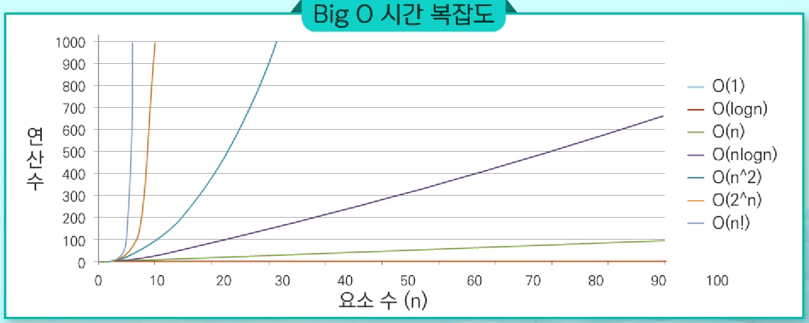
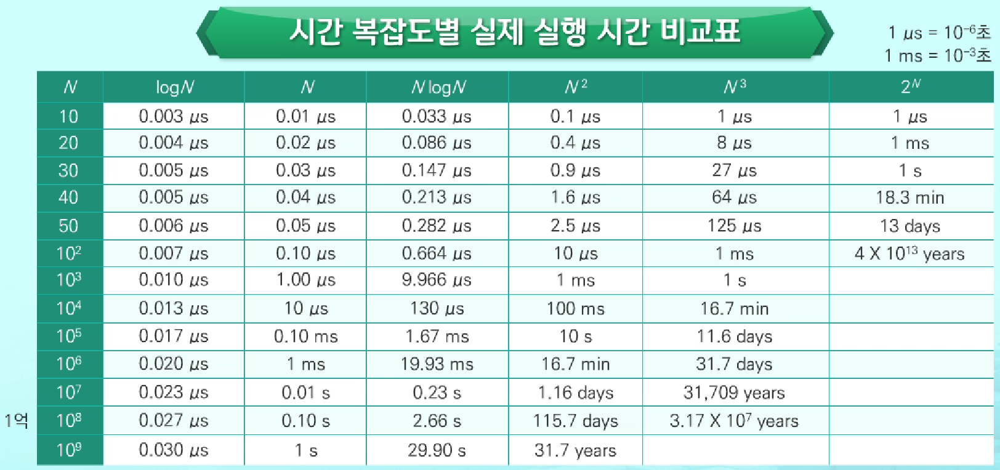
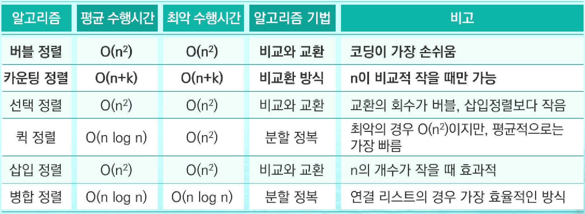
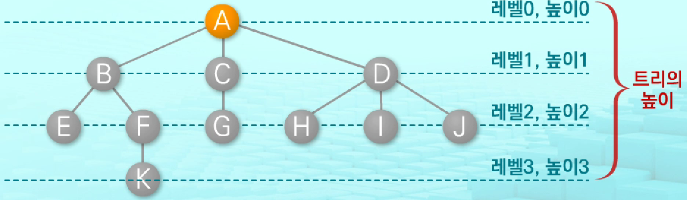
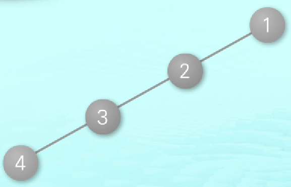
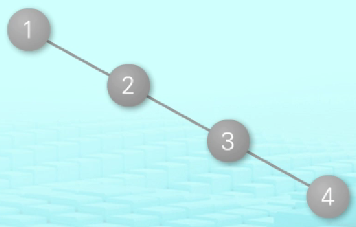
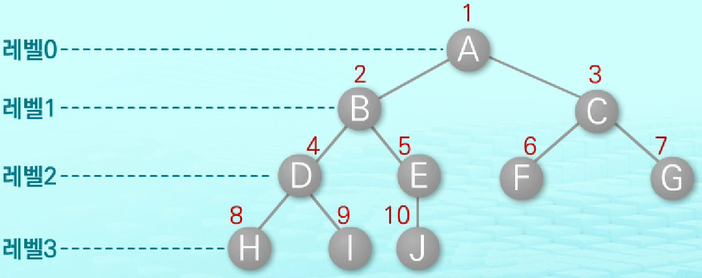

[TOC]

# 알고리즘

유한한 단계를 통해 문제를 해결하기 위한 절차/방법

컴퓨터용어로 쓰이며, 컴퓨터가 어떤 일을 수행하기 위한 단계적 방법

어떠한 문제를 해결하기 위한 절차

- 표현법

  - 슈도코드

    특정 프로그래밍 언어의 문법을 따라 쓰여진 것이 아니라, 일반적인 언어로 코드를 흉내 내어 알고리즘을 써 놓은 코드

    - 특징
      - 의사 코드로 흉내만 내는 코드
      - 실제적인 프로그래밍 언어로 작성된 코드처럼 컴퓨터에서 실행 X
      - 특정 언어로 프로그램을 작성하기 전에 알고리즘을 대략적으로 모델링

  - 순서도

    프로그램/작업의 진행 흐름을 순서에 따라 여러 가지 기호/문자로 나타낸 도표

    - 특징
      - 흐름도, 프로그램의 논리적인 흐름, 데이터의 처리 과정을 표현하는 데 사용
      - 프로그램을 작성하기 전에 프로그램의 전체적인 흐름과 과정 파악을 위해 필수적으로 거처야 되는 작업

- 성능 분석

  - 정확성 : 얼마나 정확하게 동작하는가?

  - 작업량 : 얼마나 적은 연산으로 원하는 결과를 얻어내는가?

    - 계산 방법
      - 실제 걸리는 시간 측정
      - **실행되는 명령문의 개수 계산**

    > **시간복잡도 ≒ 빅-오(O) 표기법**
    >
    > 시간 복잡도 함수 중에서 가장 큰 영향력을 주는 n에 대한 항만을 표시
    >
    > 계수는 생략하여 표시
    >
    > 
    >
    > 

  - 메모리 사용량 : 얼마나 적은 메모리를 사용하는가?

  - 단순성 : 얼마나 단순한가?

  - 최적성 : 더 이상 개선할 여지 없이 최적화되었는가?

## 검색(Search)

저장되어 있는 자료 중에서 원하는 항목을 찾는 작업

> **원하는 항목** : 목적하는 탐색키를 가진 항목
>
> **탐색키(Search Key)** : 자료를 구별하여 인식할 수 있는 키

### 순차 검색(Sequential Search) `O(n)`

일렬로 되어 있는 자료를 순서대로 검색하는 방법

- 특징

  - 리스트/연결 리스트 등 순차구조로 구현된 자료구조에서 유용

- 장점

  - 구현이 쉬움

- 단점

  - 검색 대상이 많은 경우 수행시간 ↑ → 비효율적

- 종류

  - **정렬되지 않은 경우**

    - 수행 과정

      1. 첫번째 원소부터 순서대로 검색대상과 키 값이 같은 원소가 있는지를 비교

      2. 키 값이 동일한 원소를 찾으면 그 원소의 인덱스 반환

      3. 자료구조의 마지막에 갈 때까지 검색 대상을 찾지 못하면 검색 실패

    - 평균 비교 횟수 : 1/n(1+2+3+...+n) = `(n+1)/2`

    - 시간 복잡도 : `O(n)`

  - **정렬된 경우**

    - 수행 과정

      1. 자료가 오름차순으로 정렬된 상태에서 검색을 실시한다고 가정

      2. 순차적으로 검색하면서 키 값 비교

      3. 원소의 키 값이 검색 대상의 값보다 크면 원소가 없다는 것이므로 검색 종료

    - 평균 비교 회수 : 정렬되어 있으므로, 검색 실패를 반환하는 경우 반으로 줄어듬

    - 시간 복잡도 : `O(n)`

```python
arr = [...]
key = ★

# [정렬되지 않은 경우]
for i in range(len(arr)):
    if arr[i] == key:	# 발견
        break
        
# [정렬된 경우]    
for i in range(len(arr)):
    if arr[i] == key:	# 검색 성공
        break
    if arr[i] > key:	# 검색 실패
        break
```

### 이진 검색(Binary Search) `O(log n)`

자료의 가운데 항목의 키 값과 비교하여 다음 검색의 위치를 결정하고 검색을 계속하는 방법

- 특징

  - 검색 범위의 시작점과 종료점을 이용하여 검색을 반복 수행
  - 항상 정렬된 상태의 자료 필요 (자료 삽입/삭제 시 정렬 상태로 유지하는 추가 작업 필요)

- 장점

  - 효율적
  - 빠름
    - 목적키를 찾을 때까지 이진 검색을 순환적으로 반복 수행
    - 검색 범위를 반으로 줄여가면서 수행

- 수행 과정

  1. 자료의 중앙에 있는 원소 선택

  2. 중앙 원소 값과 찾고자 하는 목표 값 비교

  3. 비교 결과에 따라 새로 검색 수행

     - 목표값 < 중앙 원소 값 : 자료의 왼쪽 반에 대해서 새로 검색 수행

     - 목표값 > 중앙 원소 값 : 자료의 오른쪽 반에 대해서 새로 검색 수행

  4. 찾고자 하는 값을 찾을 때까지 반복

```python
arr = [...]
key = ★

# [while]
left = 0
right = len(arr) - 1
while left <= right:
    mid = (left + right) // 2
    if mid == key:	# 검색 성공
        break
    elif mid > key:
        right = mid - 1
    else:
        left = mid + 1
        
# [재귀]
def recur(arr, l, r, k):
    if l > r:		# 검색 실패
        return
    else:
        mid = (l + r) // 2
        if arr[mid] == k:	# 검색 성공
            return
        elif arr[mid] > k:
            recur(arr, l, mid-1, k)
        else:
            recur(arr, mid+1, r, k)

left = 0
right = len(arr) - 1

recur(arr, left, right, key)
```

### 인덱싱(Indexing)

데이터베이스(Database)에서 유래, 테이블에 대한 동작 속도를 높임

룩 업 테이블(Look up table) 등의 용어로 사용

- 장점
  - 인덱스를 저장하는데 필요한 디스크 공간은 보통 테이블 저장에 필요한 디스크 공간보다 작음
    - 인덱스는 키-필드만 갖고 있고, 테이블의 다른 세부 항목은 갖고 있지 않음
  - List를 사용한 인덱스
    - 대량의 데이터를 매번 정렬하면, 프로그램의 반응은 느려질 수 밖에 없음
    - 대량 데이터의 성능 저하 문제를 해결하기 위해 List 인덱스 사용 가능

### 이진 탐색 트리(BST : Binary Search Tree) `O(log n)`

탐색작업을 효율적으로 하기 위한 자료구조

- 특징

  - 모든 원소는 서로 다른 유일한 키를 가짐
  - key (왼쪽 서브트리) < key (루트 노드) < key (오른쪽 서브트리)
  - 왼쪽 서브트리와 오른쪽 서브트리도 이진 탐색 트리
  - 중위 순회하면 오름차순으로 정렬된 값 얻을 수 있음

- 연산

  - 탐색(searching)

    1. 루트에서 시작

    2. 탐색할 키값 x를 루트 노드 키값과 비교

       - 키값 x = 루트 노드 키값

         탐색 연산 성공

       - 키값 x < 루트 노드 키값

         루트 노드의 왼쪽 서브트리에 대해 탐색 연산 수행

       - 키값 x > 루트 노드 키값

         루트 노드의 오른쪽 서브트리에 대해 탐색 연산 수행

    3. 서브트리에 대해 순환적으로 탐색 연산 반복

  - 삽입(insertion)

    1. 탐색 연산 수행
       - 삽입할 원소와 같은 원소가 이미 있는지 확인
    2. 탐색 실패한 위치에 원소 삽입

  - 삭제(deletion)

- 성능

  연산 시간은 트리의 높이에 좌우 `O(h)`

  - 평균 `O(log n)`

    이진 트리가 균형적인 경우

  - 최악 `O(n)`

    한쪽으로 치우친 경사 이진 트리의 경우


## 완전 검색(Exhaustive Search) = Brute-force = Generate-and-Test 기법

문제의 해법으로 생각할 수 있는 모든 경우의 수를 나열해보고 확인하는 기법

- 특징
  - 모든 경우의 수를 테스트한 후, 최종 해법을 도출
  - 일반적으로 경우의 수가 상대적으로 작을 때 유용
  - 주어진 문제를 풀 때, 우선 완전 검색으로 접근하여 해답을 도출한 후, 성능 개선을 위해 다른 알고리즘을 사용하고 해답을 확인하는 것이 바람직함
- 장점
  - 해답을 찾아낼 확률 ↑
- 단점
  - 모든 경우의 수를 생성하고 테스트하기 때문에 수행 속도 ↓

### 순열(Permutation) `nPr`

서로 다른 것들 중 몇 개를 뽑아서 한 줄로 나열하는 것

`nPr = n * (n-1) * (n-2) * ... * (n-r+1)`

`nPn = n!`

### 부분 집합

- 수

  원소 n개

  - 공집합 O `2^n`
  - 공집합 X `2^n-1`

```python
arr = [1, 2, 3, 4]

# [Loop]
bit = [0, 0, 0, 0]  	# 대상 List의 각 원소를 포함할지 말지를 정하는 List
for i in range(2):
    bit[0] = i				# 0번째 원소
    for j in range(2):
        bit[1] = j			# 1번째 원소
        for k in range(2):
            bit[2] = k		# 2번째 원소
            for l in range(2):
                bit[3] = l	# 3번째 원소
                print(bit)
                
# [비트 연산]
for i in range(1<<len(arr)):	# 1<<len(arr) : 부분 집합의 개수
    for j in range(len(arr)):	# 원소의 수만큼 비트를 비교
        if i & (1<<j):			# i의 j번째 비트가 1이면 j번째 원소 출력
            print(arr[j], end=' ')
    print()
```

#### 비트 연산자

0과 1로 이루어진 이진수에 대한 연산을 수행하는 연산자

| 종류 |                   설명                   |
| :--: | :--------------------------------------: |
| `&`  |        비트 단위로 AND 연산을 함         |
| `|`  |         비트 단위로 OR 연산을 함         |
| `<<` |  피연산자의 비트 열을 왼쪽으로 이동시킴  |
| `>>` | 피연산자의 비트 열을 오른쪽으로 이동시킴 |


## 탐욕 알고리즘(Greedy Algorithm)

최적해를 구하는데 사용되는 근시안적인 방법

- 특징
  - 여러 경우 중 하나를 결정해야 할 때마다 그 순간에 최적이라고 생각되는 것을 선택해 나가는 방식으로 진행하여 최종적인 해답에 도달
  - 일반적으로, 머리속에 떠오르는 생각을 검증 없이 바로 구현하면 Greedy 접근
- 단점
  - 각 선택의 시점에서 이루어지는 결정은 지역적으로는 최적이지만, 그것들을 계속 수집하여 최종적인 해답을 만들었다고 하여 그것이 최적이라는 보장 X

- 수행 과정

  1. 해 선택

     현재 상태에서 부분 문제를 최적해를 구한 뒤, 부분 해 집합(Solution Set)에 추가

  2. 실행 가능성 검사

     새로운 부분해 집합이 실행 가능한지 확인 (문제의 제약 조건 위반 검사)

  3. 해 검사

     새로운 부분 해 집합이 문제의 해가 되는지 확인

     아직 전체 문제의 해가 완성되지 않았다면 해 선택부터 다시 시작


## 정렬(Sort)

2개 이상의 자료를 특정 기준에 의해 오름차순/내림차순으로 재배열하는 것

> **키**
>
> 자료를 정렬하는 기준이 되는 특정 값



### 버블 정렬(Bubble Sort)

인접한 두 개의 원소를 비교하며 자리를 계속 교환하는 방식

- 특징
  - 첫 번째 원소부터 인접한 원소끼리 계속 자리를 교환하면서 맨 마지막 자리까지 이동
  - 한 단계가 끝나면 가장 큰 원소/가장 작은 원소가 마지막 자리로 정렬됨
  - 교환하며 자리를 이동하는 모습이 물 위에 올라오는 거품모양 같아서 버블 정렬이라고 함

```python
arr = [...]

for i in range(len(arr)-1, 0, -1):	# 범위의 끝 위치
    for j in range(0, i):
        if arr[j] > arr[j+1]:
            arr[j], arr[j+1] = arr[j+1], arr[j]
```

### 카운팅 정렬(Counting Sort)

항목들의 순서를 결정하기 위해 집합에 각 항목이 몇 개씩 있는지 세는 작업을 하여, 선형 시간에 정렬하는 효율적인 알고리즘

- 특징

  - 정수/정수로 표현할 수 있는 자료에 대해서만 적용 가능

    각 항목의 발생 회수를 기록하기 위해, 정수 항목으로 인덱스되는 카운트들의 리스트를 사용하기 때문

  - 카운트들을 위한 충분한 공간을 할당하려면 집합 내의 가장 큰 정수를 알아야 함

```python
arr = [...]				# 리스트 요소 (0 ~ k)
ans = [0] * len(arr)	# 정렬된 리스트
count = [0] * (k+1)		# 카운트 리스트

for i in range(len(ans)):
    count[arr[i]] += 1

for j in range(1, len(count)):
    count[j] += count[j-1]

for k in range(len(ans)-1, -1, -1):
    ans[count[arr[k]]-1] = arr[k]
    count[arr[k]] -= 1
```

### 선택 정렬(Selection Sort) `O(n^2)`

주어진 자료들 중 가장 작은 값의 원소부터 차례대로 선택하여 위치를 교환하는 방식

셀렉션 알고리즘을 전체 자료에 적용한 것

- 수행 과정
  1. 주어진 리스트 중에서 최소값 찾음
  2. 그 값을 리스트 맨 앞의 값과 교환
  3. 맨 처음 위치를 제외한 나머지 리스트를 대상으로 위의 과정 반복

> **셀렉션 알고리즘**
>
> 저장되어 있는 자료로부터 k번째로 큰/작은 원소를 찾는 방법
>
> 최소값, 최대값 혹은 중간값을 찾는 알고리즘
>
> - 수행 과정
>
>   1. 정렬 알고리즘을 이용하여 자료 정렬
>
>   2. 원하는 순서에 있는 원소 가져옴

```python
arr = [...]

for i in range(len(arr)-1):
    min = i
    for j in range(i+1, len(arr)):
        if arr[min] > arr[j]:
            min = j
    arr[i], arr[min] = arr[min], arr[i]

# [셀렉션 알고리즘 - k번째로 작은 원소]
arr[k-1]
```

### 퀵 정렬(Quick Sort)

### 삽입 정렬(Insertion Sort)

### 병합 정렬(Merge Sort)


## 패턴 매칭

### 고지식한 패턴 검색(Brute Force)

본문 문자열을 처음부터 끝까지 차례대로 순회하면서 패턴 내의 문자들을 일일이 비교하는 방식으로 동작

- 시간 복잡도
  - 최악 : `O(MN)`

### 카프-라빈 알고리즘

### KMP 알고리즘

불일치가 발생한 텍스트 문자열의 앞 부분에 어떤 문자가 있는지를 미리 알고 있으므로, 불일치가 발생한 앞 부분에 대하여 다시 비교하지 않고 매칭을 수행

- 시간 복잡도
  - 평균 : `O(M+N)`

### 보이어-무어 알고리즘

오른쪽에서 왼쪽으로 비교, 대부분의 상용 소프트웨어에서 채택하고 있는 알고리즘

패턴에 오른쪽 끝에 있는 문자가 불일치하고, 이 문자가 패턴 내에 존재하지 않는 경우, 이동거리는 패턴의 길이 만큼이 됨

- 시간 복잡도

- 장점
  - 텍스트를 모두 보지 않아도 검색 가능


## 트리(Tree)

비선형 구조로 원소들 간에 1:n 관계를 가지는 자료구조

원소들 간에 계층관계를 가지는 계층형 자료구조

상위 원소에서 하위 원소로 내려가면서 확장되는 나무 모양의 구조

- 특징

  - 한 개 이상의 노드로 이루어진 유한 집합
    - 루트(Root) : 노드 중 최상위 노드
    - 나머지 노드들 : n(>= 0)개의 분리 집합 T1, ..., TN으로 분리될 수 있음
  - 이들 T1, ..., TN은 각각 하나의 트리가 되며(재귀적 정의) 루트의 서브트리라고 함
    - 서브트리(SubTree) : 부모 노드와 연결된 간선을 끊었을 때 생성되는 트리

- 구성요소

  - 노드(node)

    트리의 원소

    - 루트 노드(Root node)

      트리의 시작 노드

    - 형제 노드(Sibling node)

      같은 부모 노드의 자식 노드들

    - 조상 노드(Ancestor node)

      간선을 따라 루트 노드까지 이르는 경로에 있는 모든 노드들

    - 자손 노드(Descendent node)

      서브트리에 있는 하위 레벨의 노드들

    - 단말 노드(리프 노드)

      차수가 0인 노드

      자식 노드가 없는 노드

  - 간선(edge)

    노드를 연결하는 선

    부모 노드와 자식 노드를 연결

  - 차수(degree)

    노드에 연결된 자식 노드의 수

    - 트리의 차수

      트리에 있는 노드의 차수 중에서 가장 큰 값

  - 높이

    노드의 레벨

    - 트리의 높이

      트리에 있는 노드의 높이 중에서 가장 큰 값

      최대 레벨

      

      > ※ 레벨 1부터 하는 경우 존재

### 이진 트리(Binary Tree)

모든 노드들이 2개의 서브트리를 갖는 특별한 형태의 트리

노드가 자식 노드를 최대한 2개 까지만 가질 수 있는 트리

- 개수

  높이 h

  - 노드의 최소 개수 `(h+1)`
  - 노드의 최대 개수 `(2^(h+1)-1)`

- 종류

  - **정 이진 트리(Full binary tree)**

    모든 노드가 0개 혹은 2개의 자식 가짐

  - **포화 이진 트리(Perfect binary tree)**

    모든 레벨에 노드가 포화상태로 차 있는 이진 트리

    - 특징
      - 최대 노드 개수를 가짐
      - 루트를 1번으로 하여 정해진 위치에 대한 노드 번호를 가짐

  - **완전 이진 트리(Complete binary tree)**

    높이가 h이고 노드 수가 n개일 때, 노드 번호 1번부터 n번까지 빈 자리가 없는 이진 트리

  - **편향 이진 트리(Skewed binary tree)**

    높이 h에 대한 최소 개수의 노드를 가지면서 한쪽 방향의 자식 노드 만을 가진 이진 트리

    - 왼쪽 편향 이진 트리

      

    - 오른쪽 편향 이진 트리

      

- 순회(Traversal)

  트리의 각 노드를 중복되지 않게 전부 방문하는 것

  트리는 비 선형 구조이기 때문에 선형구조에서와 같이 선후 연결 관계를 알 수 없음

  - 전위 순회(Preorder traversal) `VLR`

    자손노드보다 루트노드를 먼저 방문

    ```python
    # print(v, end=" ")
    recur(v*2)
    recur(v*2+1)
    ```

  - 중위 순회(Inorder traversal) `LVR`

    왼쪽 자손, 루트, 오른쪽 자손 순으로 방문

    ```python
    recur(v*2)
    # print(v, end=" ")
    recur(v*2+1)
    ```

  - 후위 순회(Postorder traversal) `LRV`

    루트노드보다 자손을 먼저 방문

    ```python
    recur(v*2)
    recur(v*2+1)
    # print(v, end=" ")
    ```

- 표현

  - 리스트 이용

    -  방법

      - 이진 트리에 각 노드 번호를 부여

        

        - 루트의 번호 1로 설정

        - 레벨 n에 있는 노드에 대해 왼쪽부터 오른쪽으로 `2n` 부터 `2^(n+1)-1` 까지 번호를 차례로 부여

        > - 노드 번호의 성질
        >
        >   노드 번호 i 기준
        >
        >   - 부모 노드 번호 `i//2`
        >   - 왼쪽 자식 노드 번호 `i*2`
        >   - 오른쪽 자식 노드 번호 `i*2+1`

      - 크기에 맞는 리스트 생성
        - 노드 번호를 리스트의 인덱스로 사용
        - 높이가 h인 이진 트리를 위한 리스트의 크기 `2^(h+1)-1`

    - 단점

      - 사용하지 않는 리스트 원소에 대한 메모리 공간 낭비 발생

        ex) 편향 이진 트리

  - 연결 리스트 이용

    리스트를 이용했을 때 단점 보완

#### Heap

완전 이진 트리에 있는 노드 중에서 키값이 가장 큰/작은 노드를 찾기 위해 만든 자료구조

- 종류

  - **최대 힙(Max heap)**

    키값이 가장 큰 노드를 찾기 위한 완전 이진 트리

    부모 노드의 키값 > 자식 노드의 키값

    루트 노드 : 키값이 가장 큰 노드

  - **최소 힙(Min heap)**

    키값이 가장 작은 노드를 찾기 위한 완전 이진 트리

    부모 노드의 키값 < 자식 노드의 키값

    루트 노드 : 키값이 가장 작은 노드

- 연산

  - 삽입

    1. 비어 있는 곳에 임시로 삽입
    2. 부모 노드와 비교 후 위치 바꾸기
    3. 자리 확정

  - 삭제

    루트 노드만 삭제 가능 (힙의 종류에 따라 최대값/최소값)

    1. 루트 노드 삭제
    2. 마지막 노드를 루트 노드 위치로 이동
    3. 자식 노드와 비교 후 위치 바꾸기
    4. 자리 확정


## Stack

물건을 쌓아 올리듯 자료를 쌓아 올린 형태의 자료구조

스택에 저장된 자료는 선형구조를 가짐

스택의 자료를 삽입/삭제 가능

마지막에 삽입한 자료를 가장 먼저 꺼냄

후입선출(LIFO, Last-In-First-Out)

- 특징

  - 자료를 선형으로 저장할 저장소(스택) 필요
    - C언어 - 배열
    - 파이썬 - 리스트
      - 장점
        - 구현 용이
      - 단점
        - 리스트의 크기를 변경하는 작업은 내부적으로 큰 overhead 발생 → 소요 시간 ↑
          - 해결 방법
            - 리스트의 크기가 변동되지 않도록 배열처럼 크기를 미리 설정
            - 동적 연결리스트를 이용하여 저장소를 동적으로 할당하여 구현
              - 장점
                - 삽입/삭제 시간 ↓
              - 단점
                - 리스트 보다 구현 복잡

- 용어

  - top : 마지막 삽입된 원소의 위치

- 연산

  - 삽입 (push)

    저장소에 자료 저장

  - 삭제 (pop)

    저장소에서 자료를 역순으로 꺼냄

  - isEmpty

    스택이 공백인지 아닌지를 확인

  - peek

    스택의 top에 있는 원소를 반환

- 수행 과정

  ex) 빈 스택에 원소 A, B, C를 차례로 삽입 후 한 번 삭제하는 연산 과정

  1. 공백스택, top -1로 초기화
  2. push A, top +1
  3. push B, top +1
  4. push C, top +1
  5. pop C, top -1

```python
s = []

# [push]
def push(item):
    s.append(item)
    
# [pop]
def pop():
    if len(s) == 0:		# underflow
        return
    else:
        return s.pop(-1)
```

### 괄호검사

- 괄호 종류

  - 대괄호 `[`, `]`
  - 중괄호 `{`, `}`
  - 소괄호 `(`, `)`

- 조건

  1. 왼쪽 괄호 개수 = 오른쪽 괄호 개수

  2. 왼쪽 괄호가 오른쪽 괄호보다 먼저 나와야 함

  3. 괄호 사이에는 포함 관계만 존재

- 수행 과정

  - 문자열에 있는 괄호는 차례대로 조사
    - 왼쪽 괄호면 스택에 삽입
    - 오른쪽 괄호면 스택에서 top 괄호를 삭제한 후 오른쪽 괄호와 짝이 맞는지 확인
      - 스택 비어있음 → 조건 1/2 위배
      - 괄호의 짝이 맞지 않음 → 조건 3 위배 
      - 문자열 끝까지 조사한 후에도 스택에 괄호가 남아있음 → 조건 1 위배

### Function call

프로그램에서의 함수 호출과 복귀에 따른 수행 순서 관리

- 수행 과정
  1. 가장 마지막에 호출된 함수가 가장 먼저 실행을 완료하고 복귀하는 후입선출 구조이므로, 스택을 이용하여 수행순서 관리
  2. 함수 호출이 발생하면 호출한 함수 수행에 필요한 지역변수, 매개변수, 수행 후 복귀할 주소 등의 정보를 스택 프레임에 저장하여 시스템 스택에 삽입
  3. 함수의 실행이 끝나면 시스템 스택의 top 원소(스택 프레임)를 삭제하면서 프레임에 저장되어있던 복귀주소를 확인하고 복귀
  4. 함수 호출과 복귀에 따라 이 과정을 반복하여 전체 프로그램 수행이 종료되면 시스템 스택은 공백 스택이 됨

#### 재귀 호출

자기 자신을 호출하여 순환 수행되는 것

- 장점
  - 프로그램 크기 ↓
  - 간단하게 작성 가능
- 단점
  - 디버깅 어려움
  - 잘못 작성하게 되면 수행 시간 ↑

##### 피보나치 수열

0과 1로 시작하고 이전의 두 수 합을 다음 항으로 하는 수열

- 정의

  `F0 = 0, F1 = 1`

  `Fi = Fi-1 + Fi-2 for i ≥ 2`

```python
# [재귀 함수]
def fibo(n):
    if n < 2:
        return n
    else:
        return fibo(n-1) + fibo(n-2)
    
# [메모이제이션] (재귀의 중복 호출 개선)
def fibo(n):
    global memo
    if n >= 2 and len(memo) <= n:
        memo.append(fibo(n-1) + fibo(n-2))
    return memo[n]
    
memo = [0, 1]

# [DP] (재귀의 overhead 발생 방지, 메모이제이션 보다 성능 면에서 효율적)
def fibo(n):
    f = [0, 1]
    
    for i in range(2, n+1):
        f.append(f[i-1] + f[i-2])
    
    return f[n]
```

### 동적 계획법(DP, Dynamic Programming)

그리디 알고리즘과 같이 최적화 문제를 해결하는 알고리즘

입력 크기가 작은 부분 문제들을 모두 해결한 후에 그 해들을 이용하여 보다 큰 크기의 부분 문제들을 해결 → 최종적으로 원래 주어진 입력의 문제를 해결

### 깊이 우선 탐색(DFS, Depth First Search)

- 방법
  - 시작 정점의 한 방향으로 갈 수 있는 경로가 있는 곳까지 깊이 탐색
  - 더 이상 갈 곳이 없게 되면, 가장 마지막에 만났던 갈림길 간선이 있는 정점으로 복귀
  - 다른 방향의 정점으로 탐색을 계속 반복하여 결국 모든 정점을 방문하여 순회
  - 가장 마지막에 만났던 갈림길의 정점으로 되돌아가서 다시 깊이 우선 탐색을 반복해야 하므로 후입선출 구조의 스택 사용


## 그래프

객체(사물/추상적 개념)들과 객체들 사이의 연결 관계 표현

정점(Vertex)들의 집합과 정점을 연결하는 간선(Edge)들의 집합으로 구성된 자료 구조

- 기호

  `G = (V, E)`

  - `|V|` : 정점의 개수
  - `|E|` : 간선의 개수
  - `|V|(|V|-1) / 2` : 그래프 최대 간선 수

- 용어

  - 경로

    간선들을 순서대로 나열한 것

    - 단순경로

      경로 중 한 정점을 최대한 한 번만 지나는 경로

    - 사이클(Cycle)

      시작한 정점에서 끝나는 경로

  - 

- 특징
  - 선형/트리 자료구조로 표현하기 어려운 N:N 관계를 가지는 원소들을 표현하기 용이

- 종류

  - 무향(Undirected)

    서로 대칭적인 관계를 연결해서 나타낸 그래프

  - 유향(Directed)

    간선을 화살표로 표현하고 방향성의 개념 포함

  - 가중치(Weighted)

    이동하는데 드는 비용을 간선에 부여한 그래프

  - 완전

    임의의 두 정점들이 모두 인접

  - 부분

    원래 그래프에서 일부의 정점/간선을 제외한 그래프

- 표현

  간선의 정보를 저장하는 방식, 메모리, 성능을 고려해서 결정

  - 인접 행렬(Adjacent matrix)

    |V| x |V| 크기의 2차원 리스트를 이용해서 간선 정보 저장

  - 인접 리스트(Adjacent List)

    각 정점마다 인접 정점으로 나가는 간선의 정보 저장

    - 정점의 개수에 비해 상대적으로 간선의 수가 적을 경우

  - 
